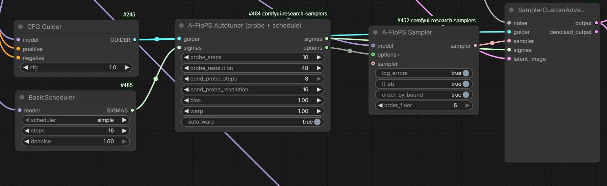

# A-FloPS Sampler for ComfyUI

An adaptive sampler. Before it samples anything, it measures the model and your
prompt with two small probe passes, and then uses those measurements to:

1. **place the steps of whatever schedule you plug in** where the measurements say
   they are needed, and
2. **decide, for each part of the picture separately, how far ahead it looks** when
   it works out where the image is heading.

> **Tested with Krea 2 and Anima models.** Other flow models are expected to work,
> but have not been verified.

## What it does

- **Measures first, samples second.** The probes run on tiny latents before the
  real sampler starts. Nothing is guessed and nothing is fitted to a formula: the
  schedule and the per-pixel decisions come from what was measured on your model
  and your prompt.
- **Keeps your scheduler.** The Autotuner fine-tunes the sigma list you give it. If
  it has no usable measurements, it passes your list through untouched.
- **Works per pixel.** Some areas of a picture follow a clear direction and can be
  pushed harder; others are busy or detailed and cannot. The sampler decides this
  separately for each area.
- **Refuses what is not safe.** A higher setting is rejected when it would make the
  step come out too large, and a corrected step is dropped when it departs too far
  from the plain one. Raising a setting can therefore never force a bad step through.

## Install

Copy this folder into `ComfyUI/custom_nodes/` and restart ComfyUI.

## Nodes

### A-FloPS Autotuner (probe + schedule)

- Inputs: `guider` (the guider your run uses), `sigmas` (any scheduler's output).
- Outputs: `sigmas` (fine-tuned) and `options` (connect this to the Sampler's
  `options+` input).

| setting | what it does |
|---|---|
| `probe_steps` | How many steps the model probe uses. This probe decides the schedule, and its result is kept for every prompt with the same model and settings. |
| `probe_resolution` | The picture size the model probe runs at. 48 is the established value. |
| `cond_probe_steps` | How many steps the prompt probe uses. This probe runs again for every new prompt, so this is the setting you feel on each generation. |
| `cond_probe_resolution` | The picture size the prompt probe runs at. 16 is the default. |
| `bias` | Where the fine-tune puts most of the steps. 1.00 keeps the placement the measurements chose. Above 1.00 puts more steps early, in the noise-heavy part, which builds structure. Below 1.00 puts more steps late, which builds detail. |
| `warp` | Moves the sigma values themselves, leaving the first and last where they are. 1.00 keeps your schedule as it is. Below 1.00 reaches low noise sooner. |
| `auto_warp` | ON: the `warp` setting is ignored and the strongest safe value is chosen for you. OFF: your `warp` value is used as set. |

### A-FloPS Sampler

| setting | what it does |
|---|---|
| `log_errors` | Writes what the sampler decides at every step to the console, and fills the Error Report node. For testing. |
| `lf_ab` | Turns the local field on or off. **ON is the shipped default.** ON: the sampler also makes small local corrections where its own step is least reliable. OFF: no local corrections. |
| `order_by_bound` | Chooses how the per-pixel order is picked. OFF: the number of previous steps that predicts the next one best. ON: the highest number of previous steps that is still safe for that pixel, so smooth areas look further ahead and busy areas do not. **ON is the shipped default.** It pairs with `order_floor`: the setting below is what the sampler is allowed to raise the order *to*. |
| `order_floor` | The lowest order the sampler may use, per pixel. 1 means the sampler decides by itself. Numbers above 1 push every pixel up to at least that value, which makes the sampler follow the direction of the trajectory harder. **6 is the shipped default**, paired with `order_by_bound` on. **Note what that combination costs:** measured on one prompt, one seed and one build, raising this from 1 to 6 nearly doubled the sampler's own final-step error (0.060-0.063 to 0.113-0.128, with no overlap between the two groups) and lowered the final image's gradient. That measurement scores distance to an exact solution, not how an image looks, and the shipped default follows the maintainer's eye across many runs rather than that number. Set it to 1 to let the sampler decide entirely on its own, or to `1` with `order_by_bound` off for the most conservative behaviour. |
| `wmax_eg_dir` | Which way the sampler reacts when its own end-of-run error measurement comes out **high**. `0` (shipped default) = no reaction; the error-based limit acts alone. `+1` = it allows the most extrapolation then. `-1` = it does the **opposite** and allows the least extrapolation then. This setting decides **which pixels** get the higher extrapolation order, so it changes the **structure** of the image more than its overall detail or sharpness. Measured: `-1` is worse than `+1` against an exact ODE solution on three analytic flows (by up to 47%). **The live range is `-1` to `0`**: `+0.5` and `+1` behave the same as each other because the error-feedback loop that used to separate them has been removed, and the response saturates above an effective limit of about 3.8. |

Both order settings still obey the safety rules described above, and a pixel the
sampler has just reset stays at order 1.

### A-FloPS Error Report

Optional. Writes the sampler's per-step decisions to a JSON file.

### A-FloPS A-Euler (paper) / A-FloPS A-Euler Schedule (paper)

The reference implementation of Algorithm 2 from Jin et al., AAAI 2026
(arXiv:2509.00036), included so the adaptive sampler can be compared against it.
These are plain samplers: they do not use the probes and they make one model call
per step. They are not needed for normal use.

## Wiring

1. Build a normal `SamplerCustomAdvanced` graph (model, noise, guider, sampler,
   sigmas).
2. Add **A-FloPS Autotuner**: connect your guider to `guider`, and your scheduler's
   output (for example BasicScheduler "simple") to `sigmas`.
3. Connect the Autotuner's `sigmas` output to `SamplerCustomAdvanced.sigmas`.
4. Add **A-FloPS Sampler**: connect the Autotuner's `options` output to its
   `options+` input, and its `sampler` output to `SamplerCustomAdvanced.sampler`.
   The Sampler's own `model` input is optional: connecting the model there lets it
   read the model's type and settings directly. The Autotuner needs no such input,
   because it receives the model through the guider.
5. Run. The first generation probes the model and the prompt and stores the
   measurements; later generations with the same model and settings reuse them.

The screenshot above is that graph for a 16-step run, with `order_by_bound` on,
`order_floor` at 6, `lf_ab` on and `auto_warp` on.

## Notes

- **Higher is not automatically better.** Looking further ahead follows the
  trajectory's direction harder, and on some models and prompts that gives a
  cleaner, more finished image, while on others it does not. The sampler measures
  per pixel and refuses what is not safe; the settings above let you push further,
  and the result should be judged by eye.
- **The first run costs more than later ones**, because of the model probe. It is
  cached per model, settings and schedule, so it is paid once per model
  configuration rather than once per generation.
- **A few experimental switches exist in the code but are not shown in the node
  interface.** They are fixed at their shipped values. They are not described here
  because they are not proven.
- **The noise control was removed.** It was measured to have no effect on the
  output on the models we tested, so the setting is gone rather than left in place
  doing nothing.
